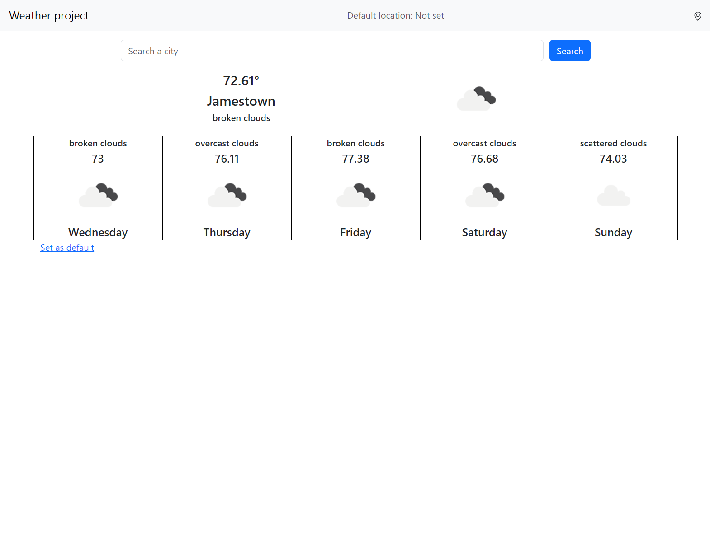
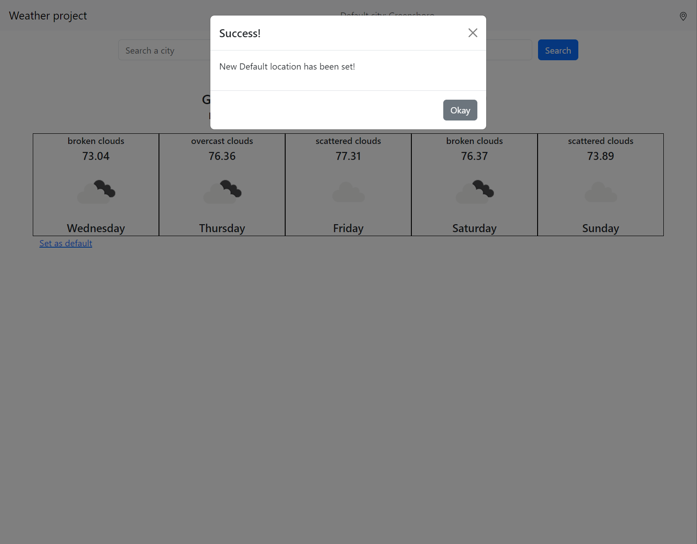
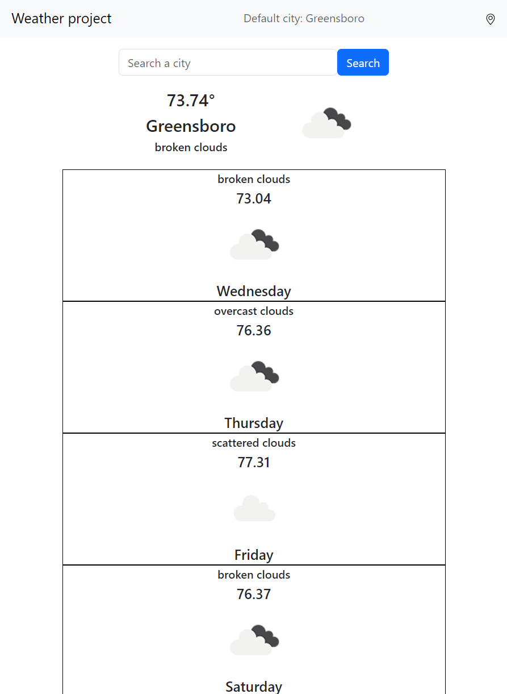

## Weather Project

This project has been created by a student at Parsity, an online software engineering course. The work in this repository is wholly of the student based on a sample starter project that can be accessed by looking at the repository that this project forks.

If you have any questions about this project or the program in general, visit [parsity.io](https://parsity.io/) or email hello@parsity.io.

# What is it?

A weather app that fetches weather data using the [open weather api](https://openweathermap.org/).

## Features

- Search weather of a city using a text input (current and 5 day forecast)
  
- Search weather of current location using JS's [geolocation api](https://developer.mozilla.org/en-US/docs/Web/API/Geolocation/getCurrentPosition)
- Set a default location that
  
- Responsive components
  

## Files/Folder overview

- index.html: main html file
- main.js: houses all classes and js functions
- style.css: houses custom css
- static: houses screenshots of project

## Technology used

- Plain old JS
- Bootstrap v5
- Jquery
